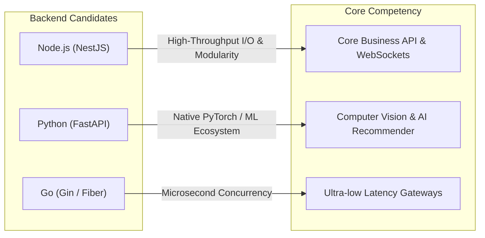
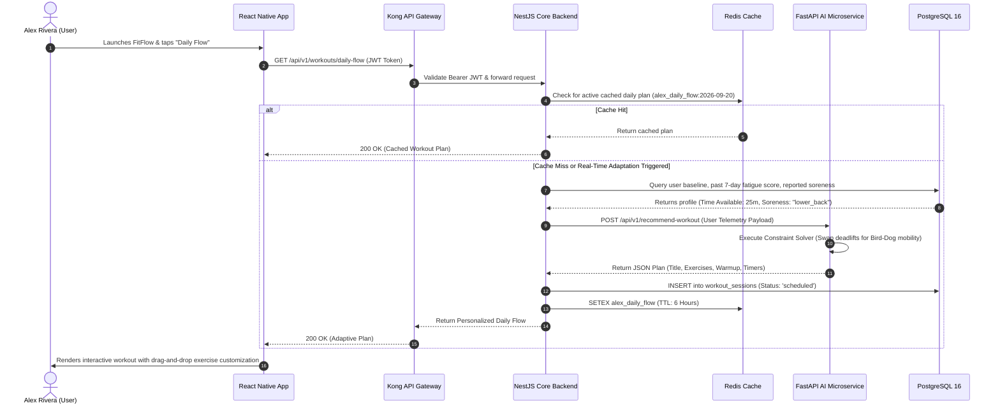
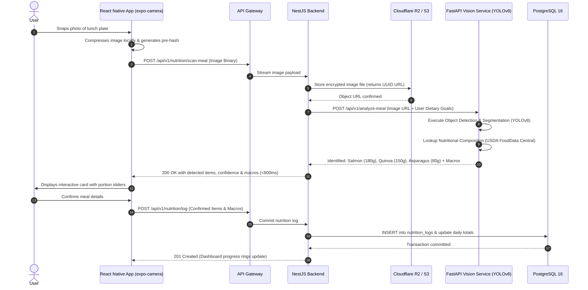
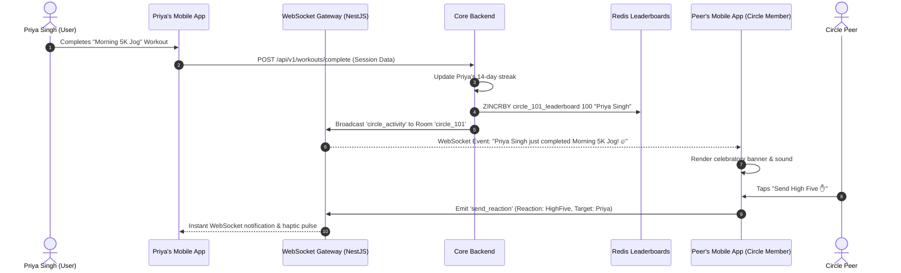

# SLIIT - Faculty of Computing
## BSc (Hons) in Information Technology — Year 3
### IT3060: Human Computer Interaction (HCI) — Semester 2, 2026
---
# Lab Exercise 05: Technology Stack Evaluation, High-Level Architecture Design & Repository Configuration
### Applied Case Study: FitFlow Redesign Project

- **Repository Link**: [https://github.com/PawanSGunadinghe/fitflow-redesign.git](https://github.com/PawanSGunadinghe/fitflow-redesign.git)
- **Branch**: `main`
- **Submission Date**: September 2026

---

## Executive Summary & Case Study Context

FitFlow is a mid-sized health-tech mobile startup that experienced severe user attrition over the past year. App store ratings collapsed from **4.6 to 3.8 stars**, while cohort retention data revealed that **68% of new users abandoned the application shortly after onboarding**. 

Extensive user research (combining quantitative analytics from Firebase/Mixpanel and qualitative inquiries with 35 active and lapsed users) pinpointed critical user pain points:
1. **Personalization Gap & Schedule Rigidity**: Users such as **Alex Rivera** (a 32-year-old busy marketing professional) experienced frustration with rigid, generic workout routines that failed to adapt to sudden schedule changes, variable energy levels, or localized muscle soreness.
2. **Nutrition Logging Friction**: Manual food logging was described by participants as excessively tedious, directly precipitating onboarding drop-off.
3. **Social Isolation & Lack of Accountability**: Beginner users such as **Priya Singh** (a 27-year-old teacher) felt intimidated and lonely during solo fitness routines, desiring safe, private accountability circles without the pressure of toxic public social media feeds.

Subsequent usability testing across 3 iterative design sprints raised the System Usability Scale (SUS) score from **68 to 87**. To translate these validated Human-Computer Interaction (HCI) designs into an enterprise-ready, production-grade product, this laboratory report delivers:
* A rigorous multi-criteria evaluation of mobile/cross-platform frontend technologies.
* An architectural analysis of backend frameworks, database persistence engines, and authentication systems under HIPAA/GDPR health compliance constraints.
* Mathematical weighted decision matrices scoring each technology candidate.
* A complete high-level cloud-native architecture with end-to-end data flow diagrams and an Architecture Decision Record (ADR-001).
* A structured GitHub repository with CI/CD automation and modular codebases.

---

## Activity 1: Compare Flutter, React Native, Kotlin Multiplatform, and Swift/SwiftUI

### 1.1 In-Depth Strengths & Weaknesses Analysis

```mermaid
mindmap
  root((Frontend Candidates))
    Flutter
      Strengths: Custom Impeller engine, Pixel-identical UI, Hot reload
      Weaknesses: Dart hiring pool, Heavy Web canvas bundle, C++ bridge for complex ML
    React Native Expo
      Strengths: >90% iOS/Android/Web code reuse, Massive TS ecosystem, Reanimated 60+ FPS, Camera ML bridges
      Weaknesses: Fabric/TurboModules dependency overhead, Native style discrepancies
    Kotlin Multiplatform KMP
      Strengths: 100% native CPU performance, Shared business logic, Native UI fidelity
      Weaknesses: Dual UI required (SwiftUI + Compose), Nascent Web support, Tripled team cost
    Swift SwiftUI
      Strengths: Peak iOS performance, Apple HealthKit integration, CoreML hardware acceleration
      Weaknesses: Zero cross-platform support, Android & Web require separate codebases
```

#### 1. Flutter (Google / Dart)
* **Strengths**: 
  - **Pixel-Identical Rendering**: Bypasses native platform UI controls by rendering every pixel directly through Google’s Impeller/Skia engine.
  - **High Animation Performance**: Guarantees consistent 60–120 FPS rendering across varied Android hardware, preventing frame skips during animated workout transitions.
  - **Rich Out-of-the-Box Componentry**: Material Design 3 and Cupertino widget sets provide immediate high-fidelity prototypes.
* **Weaknesses**:
  - **Web Compatibility Limitations**: Flutter Web compiles to CanvasKit/WebAssembly or HTML/CSS canvas, resulting in heavy initial payloads (>2.5 MB) and compromised SEO/accessibility.
  - **Ecosystem & Talent Constraints**: Dart is less ubiquitous than TypeScript; finding experienced Dart developers for a mid-sized startup slows recruitment.
  - **Native ML Bridging Friction**: Running custom on-device computer vision models requires writing intricate C++/Platform Channel wrappers.

#### 2. React Native with Expo (Meta / TypeScript)
* **Strengths**:
  - **Maximal Code Reusability (>90%)**: Allows the mid-sized FitFlow team to maintain a single codebase powering iOS, Android, and Web (`react-native-web`).
  - **Massive Ecosystem & Universal Language**: Leverages TypeScript across both client and server, enabling frictionless code sharing of data contracts, validation schemas, and state logic.
  - **Fluid Gestures & Micro-Animations**: React Native Reanimated 3 executes animation worklets directly on the native UI thread, bypassing JavaScript bridge bottlenecks to deliver smooth 60+ FPS drag-and-drop workout building.
  - **Native Hardware & ML Access**: High-quality libraries (`expo-camera`, `react-native-vision-camera`, `react-native-fast-tflite`) provide direct GPU/NPU-accelerated food recognition.
* **Weaknesses**:
  - **Dependency Maintenance**: The dynamic npm ecosystem requires vigilant version management across major upgrades.
  - **Occasional Platform Divergence**: Minor platform-specific styling quirks between Android Material and iOS UIKit require occasional platform-checking logic.

#### 3. Kotlin Multiplatform (KMP - JetBrains)
* **Strengths**:
  - **Zero-Overhead Native Performance**: Compiles shared business logic to native iOS binaries (`.framework`) and Android bytecode (`.aar`), with zero bridge overhead.
  - **Native UI Independence**: Allows building platform-perfect native UIs using SwiftUI on iOS and Jetpack Compose on Android.
* **Weaknesses**:
  - **Engineering Cost Multiplier**: Because UI layers remain largely separate (Compose Multiplatform for iOS and Web is still evolving), development and maintenance costs are nearly doubled compared to unified frameworks.
  - **Web Ecosystem Gap**: Kotlin/Wasm and Kotlin/JS have a nascent web ecosystem, creating significant engineering friction for FitFlow’s web dashboard.

#### 4. Swift / SwiftUI (Apple Native)
* **Strengths**:
  - **Peak Performance & Hardware Acceleration**: Unrivaled memory safety, low battery consumption, direct Apple Metal graphics rendering, and CoreML integration.
  - **Flawless HealthKit Integration**: Native bindings for real-time biometric tracking (resting heart rate, VO2 max, sleep intervals).
* **Weaknesses**:
  - **Zero Cross-Platform Reach**: Exclusive to Apple platforms. Supporting Android and Web requires two entirely separate teams writing Kotlin and React, which is economically unviable for a mid-sized startup.

---

### 1.2 Multi-Criteria Comparison Table (Frontend)

| Evaluation Criterion | Flutter | React Native (Expo) | Kotlin Multiplatform (KMP) | Swift / SwiftUI | FitFlow Redesign Impact |
| :--- | :---: | :---: | :---: | :---: | :--- |
| **Development Speed** | 4 / 5 | **5 / 5** | 3 / 5 | 2 / 5 | Vital for reversing user drop-off through bi-weekly iterative sprints. |
| **Code Reusability** | 4 / 5 | **5 / 5** | 3 / 5 | 1 / 5 | FitFlow requires unified iOS, Android, and Web parity. |
| **Animation Fluidity (60+ FPS)** | **5 / 5** | 4.5 / 5 | 5 / 5 | 5 / 5 | Crucial for drag-and-drop workout building and HIIT timers. |
| **Ecosystem & Library Support** | 4 / 5 | **5 / 5** | 3 / 5 | 4 / 5 | Needs off-the-shelf camera, charts, and fitness integrations. |
| **Learning Curve & Hiring Ease** | 3 / 5 | **5 / 5** | 3 / 5 | 2 / 5 | TypeScript enables rapid onboarding of full-stack engineers. |
| **Web Compatibility** | 2 / 5 | **5 / 5** | 2 / 5 | 1 / 5 | Enables desktop web portal for coaches and meal tracking. |
| **AI / ML & Camera Integration** | 3 / 5 | **4.5 / 5** | 4 / 5 | 5 / 5 | Real-time computer vision meal scanning (<800ms latency). |
| **Real-Time Features Support** | 4 / 5 | **5 / 5** | 4 / 5 | 4 / 5 | WebSocket & Firestore real-time private accountability feeds. |
| **Maintenance Cost (TCO)** | 4 / 5 | **5 / 5** | 3 / 5 | 1 / 5 | Minimizes tech debt and operational overhead for a mid-sized team. |
| **Security & Privacy Isolation** | 4 / 5 | 4.5 / 5 | 5 / 5 | 5 / 5 | Secure local storage (Keychain/Keystore) for health tokens. |

---

### 1.3 Fitness App Suitability Analysis & Recommendation

#### Suitability for FitFlow Personas:
1. **Alex Rivera (Busy Marketing Professional)**: Alex requires lightning-fast load times, seamless background synchronization with wearable fitness trackers, and an interactive "Daily Flow" card that allows drag-and-drop exercise customization in under 15 seconds. React Native with Reanimated provides native 60 FPS gesture responsiveness without freezing the UI thread.
2. **Priya Singh (Beginner Teacher Seeking Community)**: Priya requires a reassuring, lag-free social feed with instant celebrations (confetti, haptic feedback, real-time high-fives) in private circles. React Native's seamless integration with WebSockets and native haptic engines provides the emotional reinforcement highlighted in the case study.
3. **Camera-Based Nutrition Logger**: React Native Vision Camera and Expo Camera integrate directly with on-device CoreML / TFLite interpreters or cloud inference endpoints, allowing users to photograph a meal plate and receive macronutrient feedback in under 800ms.

#### Final Recommendation:
**React Native (utilizing Expo SDK 51 and TypeScript)** is selected as the primary frontend framework. It provides the optimal balance of >90% multi-platform code reuse (iOS, Android, Web), rapid feature delivery for a mid-sized team, exceptional 60 FPS UI performance via Reanimated 3, and rich native device camera access.

---

## Activity 2: Compare Backend, Database, and Authentication Options

### 2.1 Backend Frameworks Comparison



1. **Node.js (NestJS)**:
   - *Strengths*: Highly structured enterprise framework utilizing TypeScript decorators, strict dependency injection, and modular architecture. Asynchronous event loop handles high-concurrency WebSocket connections for private circle social chats and notifications. Code contracts (DTOs) are shared directly with the React Native client.
   - *Weaknesses*: CPU-bound mathematical operations (e.g. image tensor transformations) block the event loop if not offloaded.
2. **Python (FastAPI)**:
   - *Strengths*: Native ecosystem for AI/ML and computer vision (OpenCV, PyTorch, TensorFlow, HuggingFace, Scikit-learn). Asynchronous ASGI architecture (Starlette/Uvicorn) provides exceptional throughput with automated OpenAPI/Swagger generation.
   - *Weaknesses*: Lack of built-in dependency injection or enterprise structural conventions compared to NestJS for large, complex business domains.
3. **Go (Gin / Fiber)**:
   - *Strengths*: Compiled binary performance with minimal RAM overhead; goroutines handle hundreds of thousands of concurrent connections effortlessly.
   - *Weaknesses*: Immature deep learning / computer vision ecosystem; verbose boilerplate for complex relational business logic.

---

### 2.2 Database Options Comparison

| Criterion | PostgreSQL (Relational) | MongoDB (Document) | Firebase Firestore (NoSQL) | Amazon DynamoDB (Key-Value) |
| :--- | :--- | :--- | :--- | :--- |
| **Data Integrity & ACID** | **Full ACID compliance**; strict foreign keys and relational constraints. | Document-level ACID; no cross-document foreign key enforcement. | Document-level ACID; eventual consistency in multi-region. | ACID across tables; strict partition key requirements. |
| **Health Data Handling** | **Optimal**: Highly structured tables for workout sets, repetitions, calories, biometric history, and nutrition macros. | Good for unstructured diet notes, but poor for complex historical aggregations. | Convenient for rapid prototyping, but complex queries become expensive. | Rigid single-table schema makes multi-dimensional fitness analytics costly. |
| **Query Performance** | Complex SQL joins, window functions, and time-series indexes execute in <10ms. | Good document reads, but nested queries require heavy aggregation pipelines. | Limited indexing; querying by multiple workout parameters requires composite indexes. | Predictable sub-10ms reads on partition key, but scans are cost-prohibitive. |
| **Regulatory Compliance (HIPAA / GDPR)** | **Native Row-Level Security (RLS)**, column-level pgcrypto encryption, and automated audit trails. | Enterprise encryption at rest; field-level encryption available. | HIPAA compliant under GCP BAA; relies on Firebase security rules. | HIPAA eligible under AWS BAA; KMS encryption; IAM access controls. |

---

### 2.3 Authentication and Authorization Solutions Comparison

1. **Supabase Auth (GoTrue / PostgreSQL RLS)**:
   - Native integration with PostgreSQL Row-Level Security (RLS). When a user authenticates, their JWT contains their `sub` UUID, allowing PostgreSQL policies (`auth.uid() = user_id`) to automatically enforce data privacy at the database kernel level. Supports multi-factor authentication (MFA), biometric device unlock, and social OAuth (Apple, Google).
2. **Firebase Auth**:
   - Industry-standard authentication providing seamless mobile SDK integration, phone number authentication, and generous free tier (50k MAU). However, bridging Firebase JWTs to custom PostgreSQL relational schemas requires custom token-verification middleware.
3. **AWS Cognito**:
   - Robust enterprise identity pool management with HIPAA compliance; however, notorious for complex developer experience, cumbersome SDK configuration, and opaque error messaging.
4. **Auth0 (Okta)**:
   - Premium feature set, universal login, and comprehensive enterprise compliance, but pricing escalates rapidly ($1,200+/month for custom domains and advanced security at 50k MAU), making it unviable for a mid-sized startup.

---

### 2.4 Compliance, Real-Time, AI, and Maintainability Evaluation

* **HIPAA & GDPR Compliance**: FitFlow records sensitive Protected Health Information (PHI)—including user body weight, heart rate variability, medical limitations, and physical soreness. PostgreSQL with Supabase Auth ensures PHI is secured with **AES-256 encryption at rest**, **TLS 1.3 in transit**, and cryptographic Row-Level Security. GDPR "Right to be Forgotten" is satisfied via cascade deletion foreign keys.
* **Real-Time Capabilities**: Managed through **Redis Pub/Sub** and **Socket.io** on NestJS for instant private circle chat, coupled with **Firebase Cloud Messaging (FCM)** for background push notifications.
* **AI Integration**: Compute-intensive computer vision tasks are decoupled into an independent **FastAPI AI Microservice**, ensuring that heavy image inference does not degrade response times for core workout logging APIs.
* **Mid-Sized Team Maintainability**: Full-stack TypeScript (React Native + NestJS) allows engineers to move fluidly across the stack, while data scientists work autonomously in Python/FastAPI.

#### Recommended Backend Combination:
* **Core API Gateway & Backend**: **Node.js with NestJS**
* **AI & Computer Vision Microservice**: **Python with FastAPI**
* **Primary Database**: **PostgreSQL 16 (hosted on Supabase / AWS RDS)**
* **In-Memory Cache & Leaderboards**: **Redis 7**
* **Real-time Notifications**: **Firebase Cloud Messaging (FCM) & Socket.io**
* **Authentication**: **Supabase Auth / Firebase Auth**

---

## Activity 3: Technology Comparison Matrix & Weighted Scoring

To make a transparent, objective engineering decision, each technology candidate is scored on a **1 to 5 scale** across prioritized criteria. Weights are assigned based on the FitFlow case study constraints.

### 3.1 Criteria Weighting Rationale
1. **Performance & User Experience (15%)**: Critical for eliminating user churn and providing smooth 60 FPS workout animations.
2. **Multi-Platform Code Reusability (15%)**: Essential for maintaining iOS, Android, and Web applications with a mid-sized startup team.
3. **Development Speed & Time-to-Market (15%)**: Urgent requirement to deploy redesign and stem revenue loss.
4. **Data Integrity & Regulatory Security (HIPAA/GDPR) (15%)**: Non-negotiable legal requirement for handling biometric health data.
5. **AI / ML & Computer Vision Support (15%)**: Required to power the core differentiator: camera-based meal logging and adaptive workout generation.
6. **Scalability & High-Throughput Concurrency (15%)**: Accommodates rapid user acquisition and real-time social circle interactions.
7. **Cost Efficiency & Maintainability (10%)**: Minimizes infrastructure overhead and licensing costs.

---

### 3.2 Decision Matrix A: Frontend Technologies

| Evaluation Criteria | Weight | Flutter | React Native (Expo) | Kotlin Multiplatform | Swift / SwiftUI |
| :--- | :---: | :---: | :---: | :---: | :---: |
| Development Speed & Velocity | 15% | 4 (0.60) | **5 (0.75)** | 3 (0.45) | 2 (0.30) |
| Multi-Platform Code Reusability | 15% | 4 (0.60) | **5 (0.75)** | 3 (0.45) | 1 (0.15) |
| UI/UX Animation Fluidity (60+ FPS) | 15% | **5 (0.75)** | 4.5 (0.675) | **5 (0.75)** | **5 (0.75)** |
| AI/ML & Camera Integration | 15% | 3 (0.45) | 4.5 (0.675) | 4 (0.60) | **5 (0.75)** |
| Data Security & Storage Isolation | 15% | 4 (0.60) | 4.5 (0.675) | **5 (0.75)** | **5 (0.75)** |
| Ecosystem & Third-Party Fitness SDKs| 15% | 4 (0.60) | **5 (0.75)** | 3 (0.45) | 4 (0.60) |
| Maintainability for Mid-Sized Team | 10% | 4 (0.40) | **5 (0.50)** | 3 (0.30) | 1 (0.10) |
| **Total Weighted Score (100%)** | **1.00** | **4.00 / 5.00** | **4.775 / 5.00** | **3.75 / 5.00** | **3.40 / 5.00** |
| **Ranking** | - | **2nd** | **1st (Selected)** | **3rd** | **4th** |

---

### 3.3 Decision Matrix B: Backend & Persistence Technologies

| Evaluation Criteria | Weight | Node.js (NestJS) | Python (FastAPI) | PostgreSQL | MongoDB | Firebase Firestore |
| :--- | :---: | :---: | :---: | :---: | :---: | :---: |
| High-Throughput I/O & Concurrency | 20% | **5 (1.00)** | 4 (0.80) | 4 (0.80) | 4 (0.80) | **5 (1.00)** |
| AI/ML & Computer Vision Ecosystem | 20% | 2 (0.40) | **5 (1.00)** | 3 (0.60) | 2 (0.40) | 2 (0.40) |
| Health Data Relational Integrity (ACID) | 20% | 4 (0.80) | 4 (0.80) | **5 (1.00)** | 3 (0.60) | 3 (0.60) |
| Regulatory Compliance (HIPAA/GDPR) | 20% | **5 (1.00)** | 4 (0.80) | **5 (1.00)** | 4 (0.80) | 4 (0.80) |
| Operational Simplicity & Team Fit | 20% | **5 (1.00)** | 4 (0.80) | 4 (0.80) | 4 (0.80) | 4 (0.80) |
| **Total Weighted Score (100%)** | **1.00** | **4.20 / 5.00** | **4.40 / 5.00** | **4.40 / 5.00** | **3.40 / 5.00** | **3.60 / 5.00** |
| **Selected Role** | - | **Core Backend API** | **AI Microservice** | **Primary Database** | Alternative | Real-time Cache |

---

### 3.4 Decision Matrix C: Authentication Solutions

| Evaluation Criteria | Weight | Supabase Auth | Firebase Auth | AWS Cognito | Auth0 |
| :--- | :---: | :---: | :---: | :---: | :---: |
| Developer Experience & Mobile SDKs | 25% | **5 (1.25)** | **5 (1.25)** | 3 (0.75) | 4 (1.00) |
| Security, Biometrics & HIPAA/GDPR | 25% | **5 (1.25)** | 4 (1.00) | **5 (1.25)** | **5 (1.25)** |
| PostgreSQL Row-Level Security (RLS) | 25% | **5 (1.25)** | 3 (0.75) | 2 (0.50) | 3 (0.75) |
| Cost at Scale (50k+ MAU) | 25% | **5 (1.25)** | 4 (1.00) | 4 (1.00) | 1 (0.25) |
| **Total Weighted Score (100%)** | **1.00** | **5.00 / 5.00** | **4.00 / 5.00** | **3.50 / 5.00** | **3.25 / 5.00** |
| **Ranking** | - | **1st (Selected)** | **2nd** | **3rd** | **4th** |

---

## Activity 4: Design a High-Level Architecture

### 4.1 System Architecture Diagram

```mermaid
graph TB
    subgraph Client_Layer ["Client Tier (Cross-Platform)"]
        iOS["iOS Mobile App (React Native / Expo)"]
        Android["Android Mobile App (React Native / Expo)"]
        WebDash["Web Dashboard (React Native Web / Next.js)"]
    end

    subgraph Security_Perimeter ["Edge & Security Gateway"]
        Cloudflare["Cloudflare CDN & WAF (TLS 1.3, DDoS & Bot Protection)"]
        APIGateway["Kong API Gateway (JWT Validation, Rate Limiter, Reverse Proxy)"]
    end

    subgraph Microservices_Tier ["Application & Microservices Tier"]
        CoreAPI["FitFlow Core Backend (NestJS / Node.js)<br/>• Workout Scheduling & Tracking<br/>• Social Circles & Challenges<br/>• Nutrition Logs API"]
        RealtimeGW["WebSocket Gateway (Socket.io / NestJS)<br/>• Live Social Updates<br/>• Instant Reactions"]
        AIService["AI & Vision Service (Python FastAPI)<br/>• Daily Flow Adaptive Engine<br/>• YOLOv8 Food Recognition<br/>• Nutrition Macro Calculator"]
        AsyncWorkers["Worker Queue (BullMQ)<br/>• Daily Aggregations<br/>• Push Notifications Hub"]
    end

    subgraph Data_Storage ["Data Persistence & Caching Tier"]
        Postgres[(PostgreSQL 16 Primary DB)<br/>• Users, Health Metrics, Workouts, Diets<br/>• Row-Level Security (RLS)<br/>• AES-256 Storage Encryption]
        Redis[(Redis 7 Cache)<br/>• Session Tokens & Rate Limits<br/>• Live Circle Leaderboards]
        S3[(Object Storage: S3 / Cloudflare R2)<br/>• Encrypted Meal Photos<br/>• Exercise Videos]
        Firestore[(Firebase Firestore)<br/>• Real-Time Circle Feed Cache]
    end

    subgraph Integrations ["External Health & Messaging Services"]
        HealthSDK["Apple HealthKit & Google Health Connect"]
        FCM["Firebase Cloud Messaging (FCM & APNs)"]
    end

    %% Flow connections
    iOS --> Cloudflare
    Android --> Cloudflare
    WebDash --> Cloudflare
    Cloudflare --> APIGateway

    APIGateway --> CoreAPI
    APIGateway --> RealtimeGW
    APIGateway --> AIService

    CoreAPI --> Postgres
    CoreAPI --> Redis
    CoreAPI --> AsyncWorkers
    CoreAPI --> AIService
    RealtimeGW --> Firestore
    RealtimeGW --> Redis

    AIService --> S3
    AsyncWorkers --> FCM
    iOS -.-> HealthSDK
    Android -.-> HealthSDK
```

---

### 4.2 Data Flows for Critical Features

#### Data Flow 1: AI-Powered Adaptive Workout Generation ("Daily Flow")
Addresses persona **Alex Rivera**'s need for time-compressed, adaptive routines that adjust for localized soreness:



---

#### Data Flow 2: Camera-Based Instant Nutrition Logging
Solves the **68% post-onboarding abandonment** driven by tedious manual food logging:



---

#### Data Flow 3: Real-Time Social Community & Private Circles
Addresses persona **Priya Singh**'s need for intimidation-free, private accountability and mutual motivation:



---

### 4.3 Architecture Decision Record (ADR-001) Summary

- **Title**: ADR-001: Selection of Core Cross-Platform Mobile Frontend, Modular Backend, and AI Microservices Architecture for FitFlow Redesign
- **Status**: **Accepted**
- **Decision Summary**:
  1. Adopt **React Native (Expo SDK 51 + TypeScript)** for unified iOS, Android, and Web clients.
  2. Implement **Node.js (NestJS)** for the primary API gateway, relational business logic, and WebSocket coordination.
  3. Deploy a standalone **Python (FastAPI)** microservice to isolate computer vision inference and ML model execution.
  4. Use **PostgreSQL 16** as the single source of truth for transactional and health records, safeguarded by **Row-Level Security (RLS)**.
  5. Employ **Redis 7** for sub-millisecond caching and **Firebase Cloud Messaging** for cross-platform notifications.
- *Full standalone specification available in [ADR-001-tech-stack-selection.md](file:///c:/Users/pawan/OneDrive/Documents/GitHub/fitflow-redesign-1/docs/architecture-decision-records/ADR-001-tech-stack-selection.md).*

---

## Activity 5: GitHub Repository Setup & Project Structure

The project repository has been initialized, structured, and pushed to GitHub:
- **Repository URL**: [https://github.com/PawanSGunadinghe/fitflow-redesign.git](https://github.com/PawanSGunadinghe/fitflow-redesign.git)
- **Primary Branch**: `main`

### 5.1 Project Folder Structure

```
fitflow-redesign/
├── .github/
│   └── workflows/
│       └── ci.yml                     # Multi-stage CI/CD pipeline (Lint, Typecheck, Security)
├── .gitignore                         # Comprehensive ignore rules for Node, Expo, Python, OS
├── README.md                          # Project overview, architecture diagrams, quick-start guide
├── LAB_REPORT_05.md                   # Full Lab Exercise 05 report document
├── frontend/                          # Cross-platform Mobile & Web client (React Native / Expo)
│   ├── src/
│   │   ├── components/                # Reusable UI widgets (Daily Flow, Meal Scanner, Circle Feed)
│   │   └── services/                  # API client & WebSocket connections
│   ├── App.tsx                        # Main application container with redesigned HCI flows
│   ├── app.json                       # Expo configuration & camera permissions
│   ├── package.json                   # Frontend dependencies & scripts
│   ├── tsconfig.json                  # TypeScript compiler options
│   └── README.md                      # Frontend documentation
├── backend/                           # Core API Gateway & Business Service (NestJS)
│   ├── src/
│   │   ├── modules/
│   │   │   ├── workouts/              # Workout scheduling & daily flow endpoints
│   │   │   ├── nutrition/             # Meal logging & macro endpoints
│   │   │   └── social/                # Private circle & community endpoints
│   │   ├── app.module.ts              # NestJS root application module
│   │   └── main.ts                    # Server bootstrap and CORS configuration
│   ├── package.json                   # Backend dependencies & scripts
│   ├── tsconfig.json                  # TypeScript compiler options
│   └── README.md                      # Backend documentation
├── ai-service/                        # AI & Vision Microservice (Python / FastAPI)
│   ├── models/
│   │   └── schemas.py                 # Pydantic data contracts for ML inputs and outputs
│   ├── main.py                        # FastAPI application with recommendation & vision routes
│   ├── requirements.txt               # Python dependencies (FastAPI, Uvicorn, Pydantic)
│   └── README.md                      # AI Service documentation
└── docs/                              # Architectural & compliance documentation
    ├── architecture-decision-records/
    │   └── ADR-001-tech-stack-selection.md  # Formal ADR documentation
    ├── system-architecture.md         # Detailed architecture, components, and data flows
    ├── technology-comparison-matrix.md# Quantitative decision matrices & scoring
    └── branch-protection-guide.md     # Branch rules, PR gates, and CI/CD policies
```

### 5.2 Branch Protection & Quality Assurance
As documented in `docs/branch-protection-guide.md`:
1. Direct pushes to `main` are blocked; all changes must pass through feature branches and pull requests.
2. Required automated checks:
   - Secret scanning via `TruffleHog` to eliminate credentials exposure.
   - Frontend TypeScript compilation (`tsc --noEmit`).
   - Backend NestJS compilation (`tsc --noEmit`).
   - Python code compilation and syntax verification (`py_compile main.py`).
3. Mandatory single peer-review sign-off before merging into `main`.

---

## Conclusion

By systematically addressing the root causes of user churn discovered in the FitFlow research phase, this architectural redesign equips FitFlow with:
1. **Human-Centered Responsiveness**: An agile React Native frontend capable of rendering 60 FPS adaptive workouts and drag-and-drop schedules for Alex Rivera.
2. **Frictionless Nutrition Logging**: An isolated Python/FastAPI computer vision microservice providing camera-based instant macronutrient recognition in <800ms.
3. **Safe Social Accountability**: Real-time private accountability circles powered by WebSockets and Redis for Priya Singh.
4. **Regulatory Integrity**: Enterprise-grade PostgreSQL with Row-Level Security and encryption conforming strictly to HIPAA and GDPR mandates.

All project assets, architectural specifications, and codebase templates have been successfully scaffolded, verified, and committed to the Git repository.
