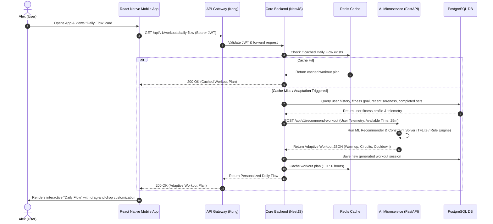
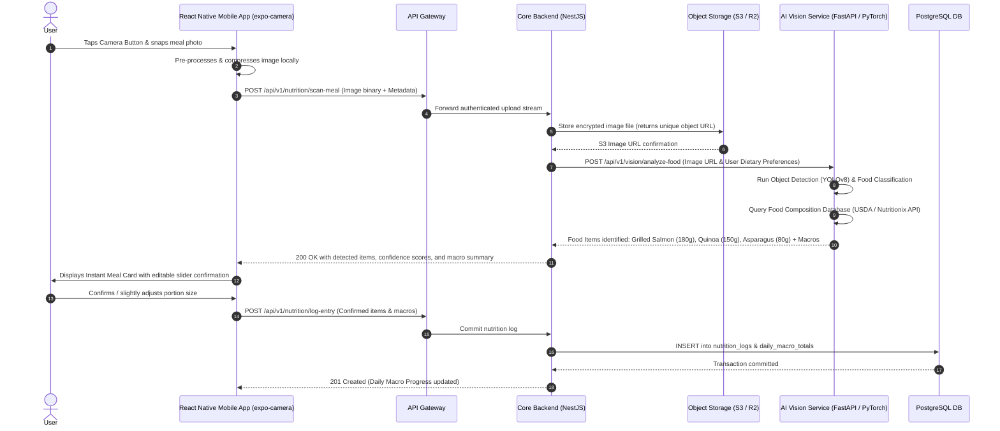
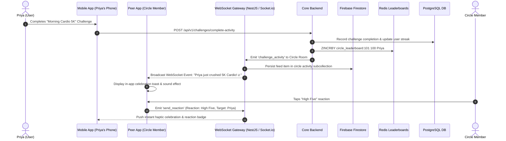

# FitFlow Redesign - System Architecture & Data Flows

This document details the high-level system architecture, component breakdowns, data flow sequences, and security/scalability considerations for the redesigned **FitFlow** health-tech platform.

---

## 1. High-Level Multi-Tier Architecture

The system follows a modern **Cloud-Native Polyglot Microservices Architecture**, separating high-throughput core business operations from compute-intensive artificial intelligence / computer vision workloads.

```mermaid
graph TB
    subgraph Client_Layer ["Client Tier (Cross-Platform)"]
        iOS["iOS Mobile App (React Native / Expo)"]
        Android["Android Mobile App (React Native / Expo)"]
        WebDash["Web Dashboard (React Native Web / Next.js)"]
    end

    subgraph Edge_Gateway ["Edge & API Gateway Tier"]
        Cloudflare["Cloudflare CDN / WAF (DDoS Protection & SSL/TLS 1.3 Termination)"]
        APIGateway["Kong / Traefik API Gateway (JWT Auth, Rate Limiting, Request Routing)"]
    end

    subgraph App_Services ["Application & Microservices Tier"]
        CoreAPI["FitFlow Core Backend (NestJS / Node.js)<br/>• User & Profile Management<br/>• Workout Scheduling & Tracking<br/>• Social Circles & Challenges<br/>• Nutrition Logs API"]
        RealtimeGW["WebSocket Gateway (Socket.io / NestJS)<br/>• Live Social Updates<br/>• Push Notifications Hub"]
        AIService["AI & Vision Service (Python FastAPI)<br/>• Daily Flow Adaptive Engine<br/>• Food Recognition Vision Model<br/>• Nutrition Macro Calculator"]
        WorkerQueue["Async Task Workers (BullMQ / Celery)<br/>• Batch Analytics<br/>• Push Notifications"]
    end

    subgraph Data_Storage ["Persistence & Caching Tier"]
        Postgres[(Primary DB: PostgreSQL / Supabase)<br/>• Users, Workouts, Diets, Circles<br/>• Row-Level Security (RLS)<br/>• Encrypted Health Records]
        Redis[(In-Memory Cache: Redis)<br/>• Session Store<br/>• Rate Limit Counters<br/>• Real-Time Leaderboards]
        S3[(Object Storage: Cloudflare R2 / AWS S3)<br/>• Meal Photos (Encrypted)<br/>• Exercise Demonstration Videos]
        Firestore[(Real-Time DB: Firebase Firestore)<br/>• Live Chat in Private Circles<br/>• Instant Notification State]
    end

    subgraph Third_Party ["Third-Party & External Integrations"]
        AppleHealth["Apple HealthKit / Google Health Connect"]
        OpenAI["OpenAI / Anthropic LLM (Workout Guidance NLP)"]
        FCM["Firebase Cloud Messaging (FCM & APNs)"]
    end

    %% Connections
    iOS --> Cloudflare
    Android --> Cloudflare
    WebDash --> Cloudflare
    Cloudflare --> APIGateway

    APIGateway --> CoreAPI
    APIGateway --> RealtimeGW
    APIGateway --> AIService

    CoreAPI --> Postgres
    CoreAPI --> Redis
    CoreAPI --> WorkerQueue
    CoreAPI --> AIService
    RealtimeGW --> Firestore
    RealtimeGW --> Redis

    AIService --> S3
    AIService --> OpenAI
    CoreAPI --> AppleHealth
    WorkerQueue --> FCM
```

---

## 2. Key Component Breakdown

| Component | Technology | Primary Responsibilities |
| :--- | :--- | :--- |
| **Frontend Application** | React Native (Expo SDK), TypeScript, Reanimated 3 | Unified cross-platform client (iOS, Android, Web). Provides 60+ FPS animated workout guidance, drag-and-drop workout builders, camera photo capture, and local state caching. |
| **Edge API Gateway** | Cloudflare WAF + Kong / Envoy | SSL/TLS 1.3 termination, IP-based rate limiting, DDoS mitigation, route dispatching, and JWT pre-validation. |
| **Core Backend Service** | Node.js (NestJS framework), TypeScript | REST and WebSocket API endpoints. Coordinates business logic, user profiles, relational workout/nutrition models, social feeds, and privacy controls. |
| **AI & Computer Vision Microservice** | Python 3.11, FastAPI, PyTorch, OpenCV, HuggingFace | Computer vision inference for camera-based food recognition, nutritional macro estimation, and heuristic/ML adaptive workout generation. |
| **Relational Database** | PostgreSQL 16 (hosted on Supabase / RDS) | ACID-compliant storage of user health records, historical workout metrics, nutrition logs, and social circle memberships. Secured with Row-Level Security (RLS) and AES-256 encryption. |
| **Caching & In-Memory Store** | Redis 7 | Sub-millisecond response caching for exercise catalog, active session tokens, rate limiting counters, and community challenge leaderboards. |
| **Real-Time Notification Hub** | Firebase Firestore & Socket.io | Push notifications (APNs / FCM) and instant messaging/activity broadcasts for private accountability circles. |
| **Encrypted Object Storage** | AWS S3 / Cloudflare R2 | Secure, pre-signed URL-based storage for meal photographs and workout demonstration media assets. |

---

## 3. Data Flow Diagrams for Critical Features

### 3.1 Feature 1: AI-Powered Personalized Adaptive Workout Plan ("Daily Flow")

This flow addresses the core pain point of persona Alex Rivera, whose hectic marketing schedule demands intelligent, real-time workout adaptations based on current energy, time constraints, and soreness.



---

### 3.2 Feature 2: Camera-Based Instant Nutrition Logging

Addresses the 68% drop-off caused by tedious manual nutrition logging. Users capture a photo of their meal, which is analyzed by computer vision models to automatically detect food items and estimate macronutrients (calories, protein, carbs, fats).



---

### 3.3 Feature 3: Real-Time Social Community & Private Circles

Addresses the isolation pain point of persona Priya Singh, providing a safe, private accountability circle with real-time cheering, challenge tracking, and privacy-protected activity sharing.



---

## 4. Security, Scalability, and Integration Considerations

### 4.1 Data Privacy & Regulatory Compliance (HIPAA, GDPR, CCPA)
1. **Protected Health Information (PHI) Isolation**:
   - Biometric data (heart rate, body fat percentage, medical conditions) is stored in a dedicated schema with column-level encryption using **AES-256-GCM**.
   - Encryption keys are managed through AWS KMS / HashiCorp Vault with automated 90-day key rotation.
2. **GDPR / CCPA Rights Enforcement**:
   - **Right to Access & Data Portability**: Users can request a full JSON export of all personal workout and nutrition history with a single tap (`GET /api/v1/user/export-data`).
   - **Right to Erasure (Be Forgotten)**: Complete automated cascade deletion of all user records, S3 meal images, and telemetry data upon account termination (`DELETE /api/v1/user/account`).
3. **Transport Layer Security**:
   - All network traffic is encrypted via **TLS 1.3**. Strict Transport Security (HSTS) is enforced with preloading enabled.

### 4.2 Scalability & Performance Engineering
1. **Horizontal Scaling**:
   - Backend NestJS services and FastAPI AI inference instances run as Docker containers orchestrated via Kubernetes (EKS) or AWS ECS, auto-scaling on CPU and request latency thresholds.
2. **Database Read/Write Splitting & Caching**:
   - PostgreSQL runs with a primary instance for transactional writes and read-replicas for query-heavy social feeds and historical analytics.
   - Redis absorbs >80% of read traffic for exercise definitions, static workout libraries, and community leaderboards.
3. **Offline-First Capabilities**:
   - React Native client uses **WatermelonDB / SQLite** for local persistence, enabling users to log workouts without an active cellular or Wi-Fi connection, with automatic background synchronization when online.

### 4.3 Integration Architecture
1. **Wearable Health SDKs**:
   - Direct synchronization with **Apple HealthKit** (iOS) and **Google Health Connect** (Android) via native bridges for steps, resting heart rate, active calories, and sleep metrics.
2. **Push Notifications**:
   - Firebase Cloud Messaging (FCM) unified with Apple Push Notification Service (APNs) for high-priority streak reminders and circle cheer notifications.
